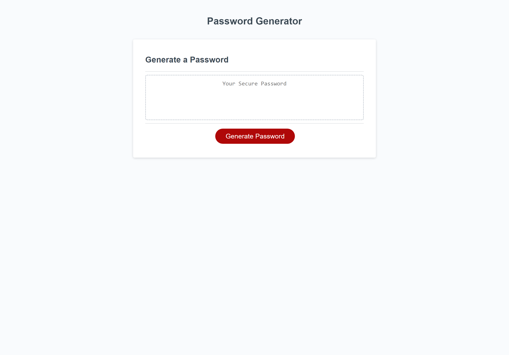

# Password Generator Utilizing Javascript

## Motivation

The motivation for this project is to create a password generator utilizing Javascript. The password generator will allow the user an option of determining which type of characters to be included in the password and the length of the password. The simple yet responsive design of the website is stream-lined for use on various screen sizes. 

In completing this project I have learned the fundamentals of Javascript; including the use of variables, functions, for loops, and event listeners. 

https://cherie2.github.io/Password-Generator-Javascript/

## Tools Utilized

## Installation

In order to utilize the website, the user needs access to a web browser. 

## Usage

To take advantage of this website's services, follow the prompts and decide what characters are desired in password as well as the length. The password will then be displayed inside the generator box. 

https://cherie2.github.io/Password-Generator-Javascript/

## Credits

Resources of significance:

Special thanks to Ileriayo Adebiyi https://github.com/Ileriayo/markdown-badges#testing for his public library of common badges

## License

Please refer to License file in Repository.

